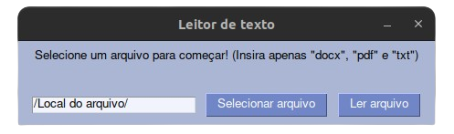

# Converter texto em áudio 👨‍💻
_Canal do Youtubee: https://www.youtube.com/@Devprogramming-y
<div align="center">

</div>
<div align="center">

<p>    </p>

</div>


## -  Objective 🛠️
Este projeto foi criado para ajudar pessoas que desejavam uma tecnologia de conversão de texto em fala para leitura de livros ou textos...".pdf", ".txt" e ".docx"


## - Technologies 🚀️
Neste projeto eu usei: **docx2txt, PyPDF2, PySimpleGUI, python-docx, darkdetect, speech_recognition, playsound, os and gtts.**.



## - Como configurar 👨‍💻
Primeiro clone este projeto usando:
```
git clone https://github.com/devprogramming-y/converter-texto-em-audio.git
```
Instalação: Primeiro, certifique-se de ter todas as bibliotecas instalada. Se ainda não tiver, execute o seguinte comando no terminal:
```
pip install -r requirements.txt
```
Depois disso é só executar o arquivo python e tudo deverá estar funcionando! :)

